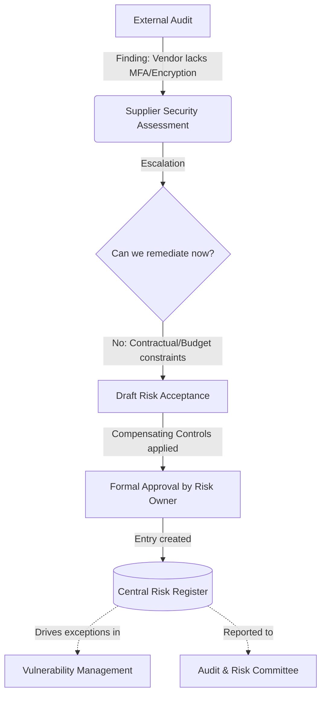

# Risk Management: When accepting a risk is the right call — and how to write it so it survives scrutiny

**Status:** $\textcolor{ForestGreen}{\textsf{Production-tested}}$ (Methodology derived from real engagements, anonymised for the XUST portfolio universe)

This repository demonstrates the governance mechanics of formal risk acceptance. It focuses on a specific, high-friction scenario: a critical third-party vendor that fails a security audit, but cannot be immediately replaced due to business constraints.

It is part of the [XUST GRC Portfolio Universe](https://github.com/YOURHANDLE/university-grc-case-study), meaning it operates under realistic constraints: a public university with a small IT security team, a tight budget, and complex political realities where business units (Faculties/HR/Finance) often hold more leverage than IT.

## The Scenario

During an annual supplier security assessment, an external auditor flagged a critical finding: **"EduPay"**, a regional third-party payroll and HR software vendor used by XUST, lacks multi-factor authentication (MFA) and encryption at rest. 

The vendor holds staff Personally Identifiable Information (PII) and payroll data, triggering significant POPIA (Protection of Personal Information Act) and King IV compliance concerns. However, the vendor is small and their roadmap for these features is 18 months out. Furthermore, XUST is 10 months into a 24-month contract, and the cost to migrate to a new vendor immediately exceeds the entire annual IT security budget.

The finding cannot be remediated immediately. It must be formally accepted, with compensating controls, and recorded in the central Risk Register.

## Why this matters

Risk acceptance is often treated as a "get out of jail free" card by business units, or a sign of defeat by security teams. In reality, it is a core governance function. 

A poorly written risk acceptance is just an undocumented vulnerability. A well-written one:
1. Acknowledges the reality of business constraints.
2. Quantifies the exposure.
3. Implements compensating controls to lower the residual risk.
4. Sets a hard expiration date tied to a remediation plan.
5. Surfaces the decision to the correct level of accountability (e.g., Risk Committee, not just the IT Director).

This repository shows how to construct an acceptance that an auditor will respect and a Board will understand.

## What is in this repository?

As with all major artefacts in this portfolio, the work is presented as a trio:

| File | Purpose |
|---|---|
| [`template.md`](template.md) | **The Format:** A reusable risk acceptance template. (CC BY-SA 4.0 — take it, adapt it). It includes guidance notes for different scenarios, including legacy internal systems. |
| [`worked-example.md`](worked-example.md) | **The Execution:** The template fully completed against the XUST third-party vendor scenario described above. |
| [`decision-record.md`](decision-record.md) | **The Judgment:** The "meeting where it was challenged." This file documents the constraints, the options rejected, and how the decision was defended against anticipated pushback from auditors and regulators. |

## How this connects to the broader GRC programme

*Note: The central Risk Register referenced here is a core governance artefact that tracks all enterprise risks across the XUST universe. It is maintained as a separate, foundational document.*
